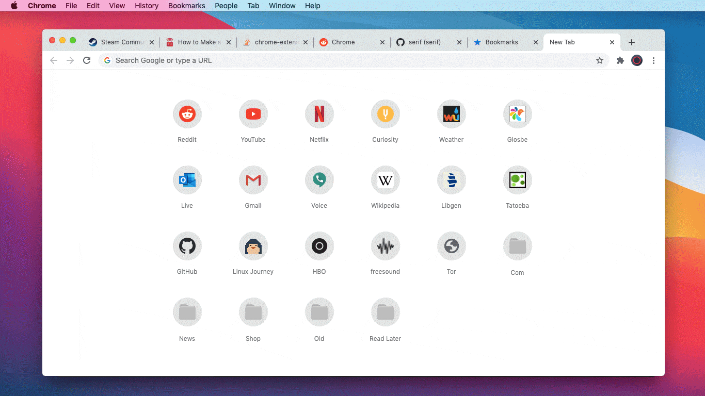

#  Native Tab

Simple speed dial for Chrome. Minimal, private, no-frills. ⟨**βETA**⟩

- Does not show 'recommended pages' or ads
- Collects no information about the user
- Uses only native browser functionality
- Does not connect to third-party servers
- Uses built-in Chrome bookmarks
- Adapts automatically to system themes
- Completely non-commercial project

## Caveats

- Use cmd+D / ctrl+D to add a bookmark for the current tab
- Bookmark management is not yet built-in
- Use Chrome's Bookmark Manager to make changes. Open with:
  - Mac: cmd+opt+B
  - Win: ctrl+alt+B
  - Nix: ctrl+alt+B
  - Any: ⋮ (menu) > Bookmarks > Bookmark Manager
- For now a permissions issue stops folders from opening

## Install

While in βeta, this will not be added to the Chrome Web Store. To try this in the mean time:

- Download and extract the zip where you want to keep it
- In Chrome click the puzzle piece, then Manage Extensions (or ⋮ (menu) > Settings > Extensions)
- Click the [Load unpacked] button and find the extracted extension

## Acknowledgements

- This extension began with [Custom New Tab URL](https://chrome.google.com/webstore/detail/custom-new-tab-url/mmjbdbjnoablegbkcklggeknkfcjkjia?hl=en) by oeg as a base. Instead of my extension, you could use that one to point your new tab page to `chrome://bookmarks/`
- Logo by [Land-of-Web](https://www.land-of-web.com), part of a social badge [icon set](https://iconarchive.com/show/badge-social-icons-by-land-of-web.html)
- Folder icons are simple derivations of [work](https://iconarchive.com/show/small-n-flat-icons-by-paomedia/folder-icon.html) by [Paomedia](https://www.paomedia.com)
